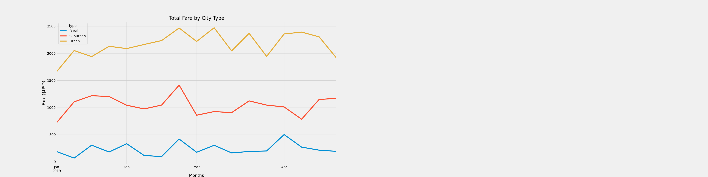

# Pyber-Analysis
Creating visualizations of rideshare data for PyBer (fake company) to help improve access to ride-sharing services and determine affordability for underserved neighborhoods.

## Overview
The purpose of this project is to create a summary dataframe using ride-sharing data by city type. Then, using Pandas and Matplotlib, create a multiple-line graph that shows the total weekly fares for each city type.

## Results

Based on the multiple-line graph, we see that Urban cities make more profit compared to Suburban and Rural cities. Between the end of February and begining of March, there is a spike in total fares. For Urban cities, the spike is followed by two more spikes before dropping at the end of April -- total fares in rural cities followed a similar trajectory. Rural cities saw a spike at the start of April with a steady decline at the end of the month. Suburban cities experienced one spike in fare totals but just as quickly dropped by the start of March.

## Summary
Based on the results, three recommendations to address disparities among city types are:
- Increasing total number of drivers in rural & subburban cities 
- Decreasing fare per ride (Driver's fare will decrease as a result)
- Partner up with local businesses to not only show support for the community, but promote brand and attract more customers

Increasing the number of drivers in rural cities and decreasing fares will make rides more accessible and affordable for many underserved neighborhoods. 
